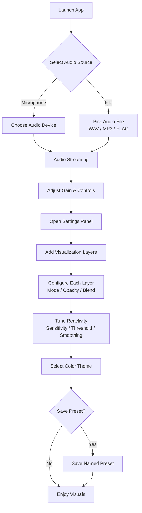
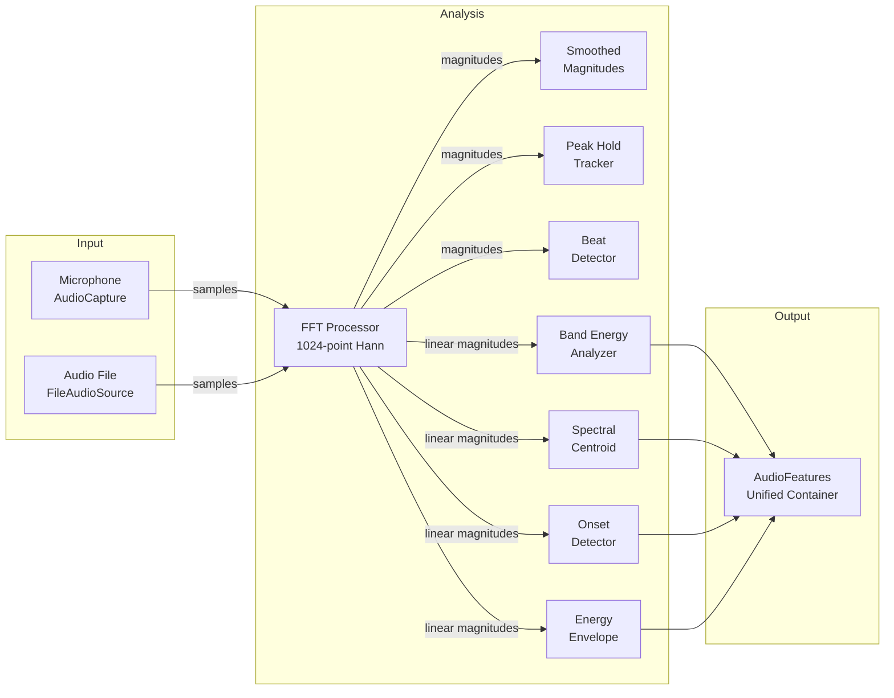
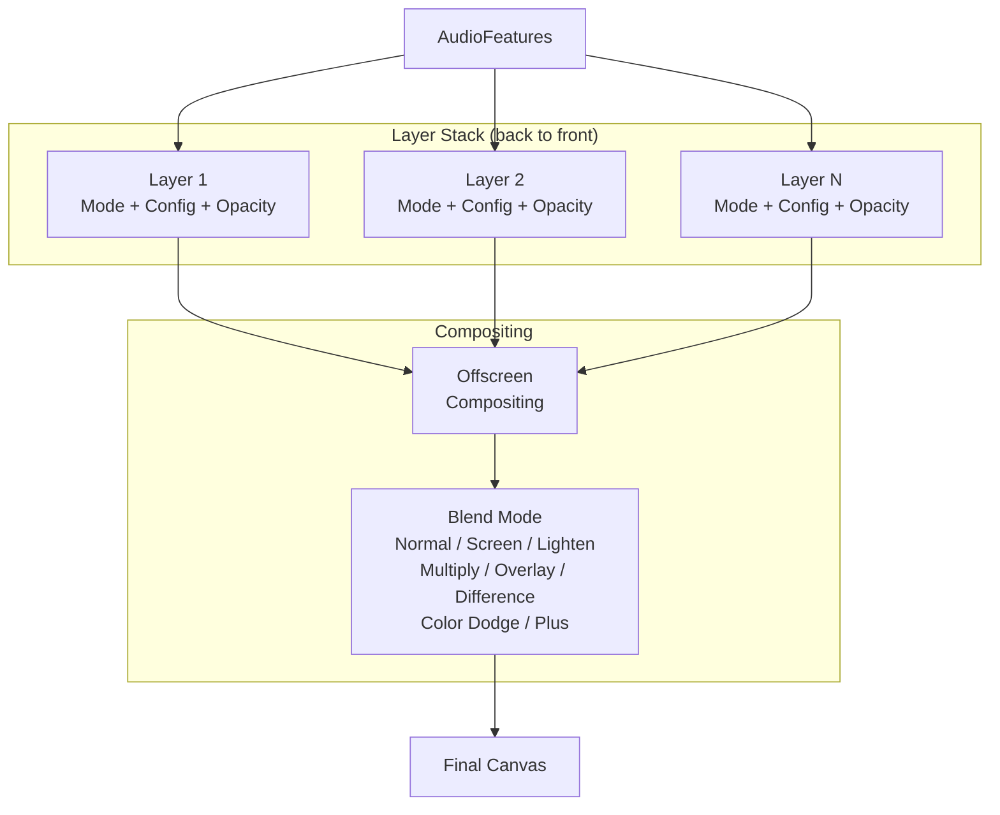
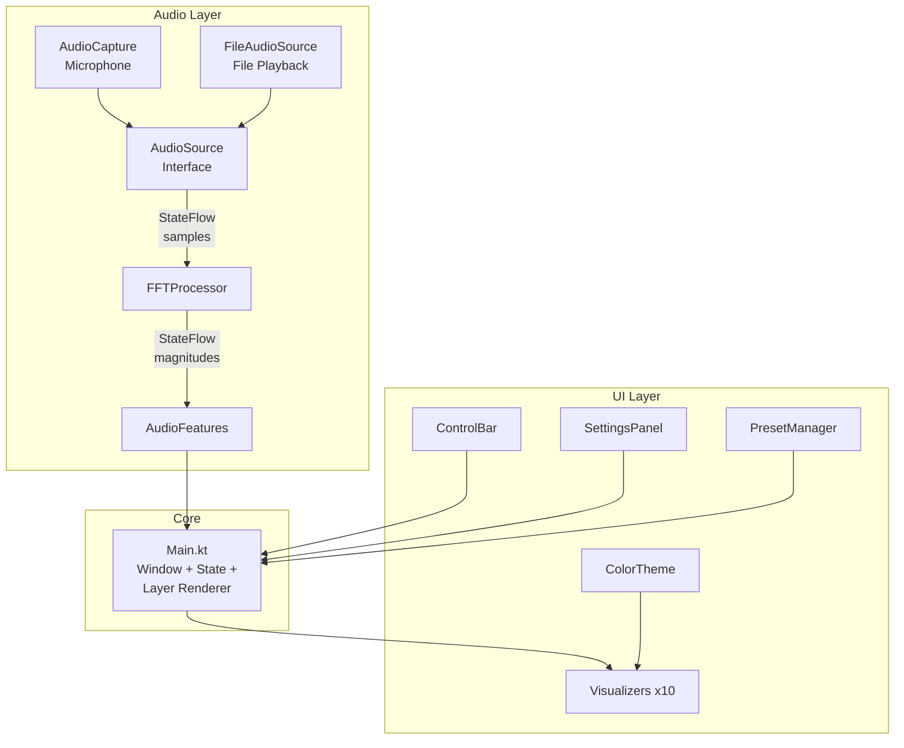

# Audio Visuals

Real-time audio visualization desktop application built with Kotlin and Jetpack Compose Desktop. Captures audio from microphone or plays audio files, analyzes frequency data in real-time, and renders 10 visualization modes with multi-layer compositing, color themes, and configurable presets.

## Features

- **10 visualization modes** — from classic spectrum bars to noise-driven flow fields and 3D terrain
- **Multi-layer compositing** — stack visualizers with 8 blend modes and per-layer opacity
- **Advanced audio analysis** — beat detection, onset detection, spectral centroid, band energy, energy envelope
- **Audio input** — real-time microphone capture with device selection, or file playback (WAV, MP3, FLAC)
- **4 color themes** — Spectrum, Neon, Monochrome, Warm
- **Preset system** — save/load/delete visualization configurations
- **Configurable reactivity** — per-band sensitivity, beat threshold, smoothing controls

## Visualization Modes

| Mode | Description |
|------|-------------|
| **Bars** | Spectrum analyzer with peak holds and log scaling |
| **Waveform** | Smooth amplitude curves with gradient fill |
| **Circular** | Radial spectrum arranged in a circle |
| **Particles** | Physics-based particles spawned by frequency bands |
| **Kaleidoscope** | Symmetric wedge rotation with breathing effect |
| **Trails** | Flowing trail curves with gradient fade and hue cycling |
| **Mandala** | Concentric rotating rings with configurable shapes |
| **Flow Field** | 3000 particles driven by OpenSimplex2 noise fields |
| **Terrain** | 3D perspective wireframe terrain driven by audio + noise |
| **Curves** | Mathematical curves — Lissajous, Rose, Spirograph |

## User Flow



## Audio Processing Pipeline



## Layer Rendering Pipeline



## Architecture



## Tech Stack

| Layer | Technology |
|-------|-----------|
| Language | Kotlin 2.3.0 |
| UI Framework | Jetpack Compose Desktop 1.10.0 |
| Graphics | Compose Canvas (`DrawScope`) — GPU-accelerated via Skia/Skiko |
| Audio | Java Sound API (`javax.sound.sampled`) — built into JDK |
| Async | Kotlin Coroutines 1.10.1 |
| Serialization | kotlinx-serialization-json 1.8.0 |
| FFT | JTransforms 2.4 |
| MP3 | mp3spi 1.9.5.4 + jlayer 1.0.1.4 |
| FLAC | jflac-codec 1.5.2 |
| Noise | OpenSimplex2 (pure Kotlin port) |

### Graphics Rendering

All visualizations are drawn using Compose Desktop's `Canvas` composable and `DrawScope` primitives — `drawLine()`, `drawCircle()`, `drawRect()`, `drawArc()`, `drawPath()`. There is no external graphics engine (no OpenRNDR, Processing, or direct OpenGL).

Under the hood, Compose Desktop renders through **Skia** (via Skiko), so all draw calls are GPU-accelerated without touching any GPU API directly. This is how 3000+ particles, multi-layer compositing, and 3D wireframe projection all run smoothly at 60fps.

If heavier effects are needed in the future (custom shaders, full 3D with z-buffers, fluid simulation), the project could integrate OpenRNDR or direct Skia/OpenGL access. For everything built so far, Compose Canvas has been sufficient.

## Getting Started

### Prerequisites

- JDK 11 or higher
- Audio input device (microphone) or audio files

### Run from Source

```bash
./gradlew run
```

### Build Distribution

```bash
./gradlew packageDmg        # macOS
./gradlew packageMsi        # Windows
./gradlew packageDeb        # Linux
```

## Controls

| Control | Function |
|---------|----------|
| Source Toggle | Switch between Microphone and File input |
| Device Selector | Choose audio input device (mic mode) |
| File Picker | Browse for WAV/MP3/FLAC files |
| Gain Slider | Input gain (0–5x) |
| Pause/Resume | Freeze audio analysis |
| Log Scale | Toggle linear/logarithmic frequency display |
| Theme Selector | Switch between 4 color themes |
| Settings | Open layer editor and reactivity controls |

## Project Structure

```
src/main/kotlin/
├── Main.kt                          # Entry point, window, state, layer renderer
├── audio/
│   ├── AudioSource.kt               # Audio source interface
│   ├── AudioCapture.kt              # Microphone input with device selection
│   ├── FileAudioSource.kt           # File playback (WAV/MP3/FLAC)
│   ├── FFTProcessor.kt              # 1024-point FFT with Hann window
│   ├── SmoothedMagnitudes.kt        # Exponential decay smoothing
│   ├── LogBinMapper.kt              # Perceptual frequency binning
│   ├── PeakHoldTracker.kt           # Peak hold with slow decay
│   ├── BeatDetector.kt              # Bass energy spike detection
│   ├── BandEnergyAnalyzer.kt        # Sub-bass/bass/mids/highs RMS
│   ├── SpectralCentroidTracker.kt   # Frequency brightness metric
│   ├── OnsetDetector.kt             # Per-band spectral flux
│   ├── EnergyEnvelope.kt            # Global RMS envelope
│   ├── AudioFeatures.kt             # Unified analysis container
│   ├── ReactivityConfig.kt          # Sensitivity/smoothing config
│   └── OpenSimplex2.kt              # Pure Kotlin noise utility
└── ui/
    ├── SpectrumVisualizer.kt        # Bar spectrum
    ├── WaveformVisualizer.kt        # Smooth waveform curves
    ├── CircularVisualizer.kt        # Radial spectrum
    ├── ParticleVisualizer.kt        # Physics particle system
    ├── KaleidoscopeVisualizer.kt    # Symmetric wedge rotation
    ├── TrailsVisualizer.kt          # Trail fade curves
    ├── MandalaVisualizer.kt         # Concentric rotating rings
    ├── FlowFieldVisualizer.kt       # Noise-driven particle flow
    ├── TerrainVisualizer.kt         # 3D wireframe terrain
    ├── CurvesVisualizer.kt          # Lissajous / Rose / Spirograph
    ├── ColorTheme.kt                # Theme presets
    ├── VisualizationMode.kt         # Mode enum (10 modes)
    ├── VisualizerConfig.kt          # Sealed config hierarchy
    ├── VisualizerLayer.kt           # Layer model + blend modes
    ├── Preset.kt                    # Preset data class
    ├── PresetManager.kt             # Save/load/delete presets
    ├── ControlBar.kt                # Bottom control UI
    └── SettingsPanel.kt             # Right-side settings overlay
```

## Audio Analysis Features

| Feature | Description | Range |
|---------|-------------|-------|
| Band Energies | RMS energy for sub-bass, bass, mids, highs | 0–1 |
| Beat Detection | Bass energy spike with cooldown | boolean |
| Onset Detection | Per-band spectral flux impulses | boolean per band |
| Spectral Centroid | Weighted average frequency (brightness) | 0–1 |
| Energy Envelope | Global RMS with attack/release | 0–1 |
| Peak Hold | Per-bin peak with slow decay | dB scale |
| Log Binning | Perceptual frequency mapping (6 bands/octave) | ~44 bins |

## Blend Modes

| Mode | Effect |
|------|--------|
| Normal | Standard alpha compositing |
| Screen | Additive light (bright + bright = brighter) |
| Lighten | Takes lighter pixel from each layer |
| Multiply | Darkening (color × color) |
| Overlay | Combination of multiply and screen |
| Difference | Absolute difference between layers |
| Color Dodge | Bright, saturated highlights |
| Plus | Simple additive blending |

## Presets

Presets are saved to `~/.audio-visuals/presets/` as JSON files. Each preset stores:
- Layer configuration (mode, config, opacity, blend mode per layer)
- Color theme selection
- Reactivity settings (band sensitivity, beat threshold, smoothing)

## License

MIT
